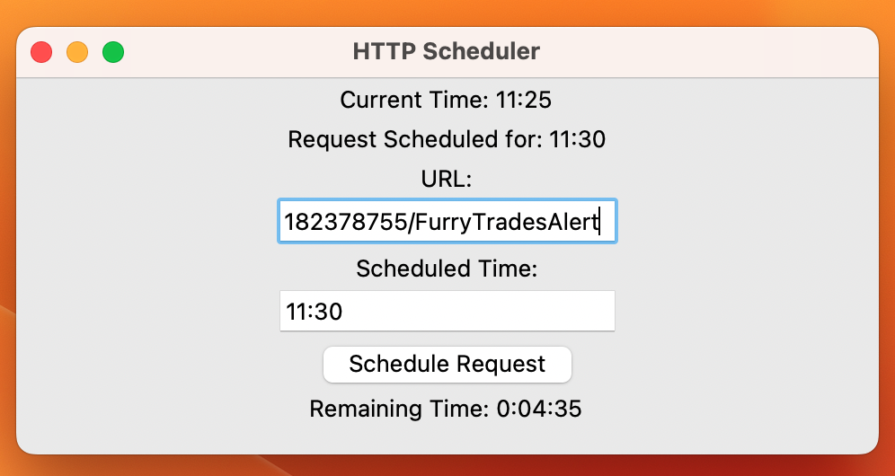

# Tkinter

 A general-purpose GUI in Python for web requests.

 

 ## Needed Software

 * First, make sure you have [Github Desktop](https://desktop.github.com/) installed.

 * Also [install Python](https://www.python.org/) on your computer (use the Windows store).

 * Install [Visual Studio Code](https://code.visualstudio.com/) or any other text editor.

 Set up your GitHub account.

 Clone the repository by clicking `File > Clone Repository...`

 Go to "URL" Section

 Paste in the URL for this repository.

## Running the Program

* Open a new terminal in Visual Studio code within the Tkinter project.

Keyboard shortcut ``Ctrl + ```

* Run `python gui.py`